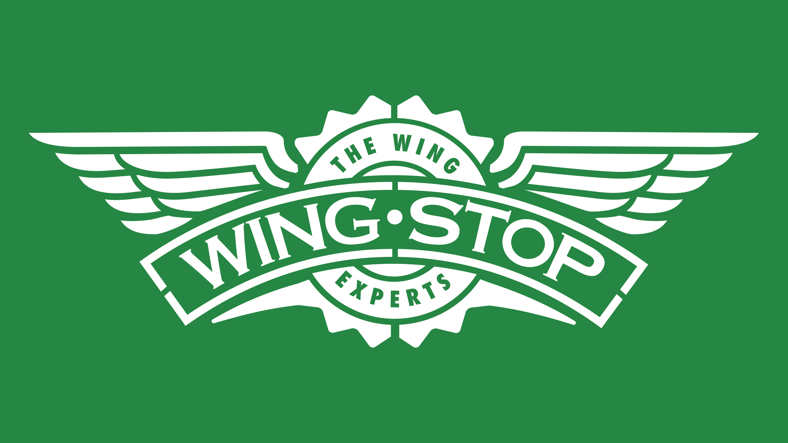

# Wing User Guide

<!-- // Update the title above to match the actual product name -->
```
This is
 __  __  __  ____  __ _  ____
\   /   /  /|_  _||  | ||  __|_
 \   /\   /  _||_ | || || |__  |
  \_/  \_/  |____||_|__||______|
```

<!-- // Product screenshot goes here -->


<!-- // Product intro goes here -->
Hi! I'm Wing, your wingman haha. I'm a Personal Assistant Chatbot 
that helps you keep track of all your various tasks.

***Note**: All Todos, Deadlines, and Events are considered a Task.
Take it that they are <ins>specific</ins> types of Tasks.*

## Adding a Todo : `todo`

<!-- // Describe the action and its outcome. -->
A Todo is a task without any date/time attached to it. I can add one to your task list.  
*e.g., buy a 6-piece boneless meal*

<!-- // Give examples of usage -->

Example input: `todo buy a 6-piece boneless meal`

<!-- // A description of the expected outcome goes here -->
Expected output:
```
____________________________________________________________
sigh another task. I've added this task: 
 [T][ ] buy a 6-piece boneless meal
Now there's 9 task(s) in your list.
____________________________________________________________
```

## Adding a Deadline : `deadline`

A Deadline is a task that needs to be done before a specific date/time. I can add one to your task list.  
*e.g., finish all the ranch before sister comes home*

Example input: `deadline finish all the ranch /by sister comes home`

Expected output:
```
____________________________________________________________
sigh another task. I've added this task: 
 [D][ ] finish all the ranch (by: sister comes home)
Now there's 10 task(s) in your list.
____________________________________________________________
```

## Adding an Event : `event`

An Event is a task that starts at a specific date/time and ends at a specific date/time. 
I can add one to your task list.  
*e.g., take away Wingstop during non-rush hour from 4pm to 5pm*

Example input: `event take away Wingstop during non-rush hour /from 4pm /to 5pm`

Expected output:
```
____________________________________________________________
sigh another task. I've added this task: 
 [E][ ] take away Wingstop during non-rush hour (from: 4pm to: 5pm)
Now there's 11 task(s) in your list.
____________________________________________________________
```

## Listing all tasks : `list`

I can list out all the tasks (i.e. Todos, Deadlines and Events) in your task list.  
*e.g., list out all the tasks in my task list right now*

Example input: `list`

Expected output:
```
____________________________________________________________
Here's your list:
 1. [T][X] borrow books
 2. [D][ ] have a party (by: 4pm)
 3. [D][X] b o o k (by: 4pm)
 4. [E][ ] wait (from: book to: 4pm)
 5. [T][X] book.lol
 6. [T][ ] buy a 6-piece boneless meal
 7. [D][ ] finish all the ranch (by: sister comes home)
 8. [E][ ] take away Wingstop during non-rush hour (from: 4pm to: 5pm)
____________________________________________________________
```

## Deleting a Task : `delete`

I can delete any task from your task list. Out of sight, out of mind!  
Just give me the task's index in your task list.  
*e.g., delete task of index 2 from my task list*

Example input: `delete 2`

Expected output:
```
____________________________________________________________
Phew! I've removed this task for you:
[D][ ] have a party (by: 4pm)
Now there's 7 task(s) in your list.
____________________________________________________________
```

## Marking a Task : `mark`

I can mark any task in your task list as done. ( Denoted as [X] )  
Just give me the task's index in your task list.  
*e.g., mark task of index 2 in my task list*

Example input: `mark 2`

Expected output:
```
____________________________________________________________
YAY! I've marked this task as done:
[T][X] buy a 6-piece boneless meal
____________________________________________________________
```

## Unmarking a Task : `unmark`

Realised you're not done with a task? I can unmark any task in your task list.  
Just give me the task's index in your task list.  
*e.g., unmark task of index 2 in my task list*

Example input: `unmark 2`

Expected output:
```
____________________________________________________________
ok sure. This task is unmarked:
[T][ ] buy a 6-piece boneless meal
____________________________________________________________
```

## Find Tasks with a keyword : `find`

I can list out all the tasks in your task list that has a keyword you want in its description.
Even if its part of another word or phrase! The search is case-insensitive.    
**Note**: ONLY if the keyword is in the task's description. NOT in its /by, /from or /to dates.
*e.g., find tasks with the word book in its description*

Example input: `find book`

Expected output:
```
____________________________________________________________
Here are the tasks that have the word 'book':
 1. [T][X] borrow books
 2. [T][X] book.lol
____________________________________________________________
```

## Exiting the program : `bye`

To exit this application, just say "bye". I'll get the hint that you're sick and tired of me.  
*e.g., Wing, go to sleep. bye!*

Example input: `bye`

Expected output:
```
____________________________________________________________
Ok. Bye.
____________________________________________________________
```

## Saving the data

Task list data is saved in a file called wing.txt (located in `./data/wing.txt`) automatically 
after any command that changes the data. There is no need to save manually.  
Don't worry! Even if you're starting fresh or the file isn't there, I will create one for you <3
